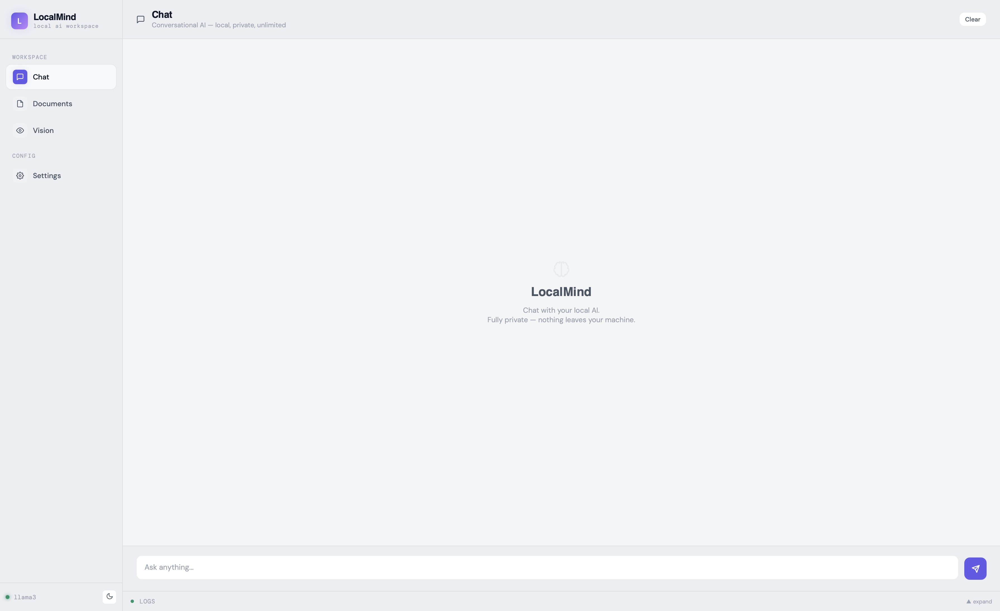
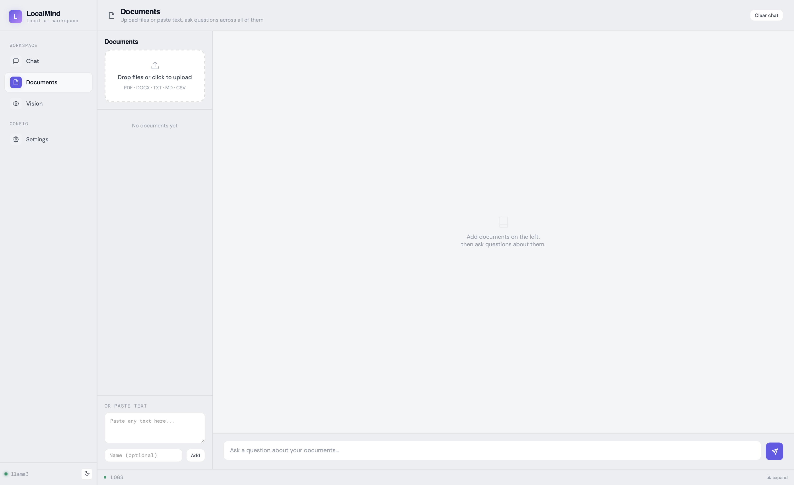
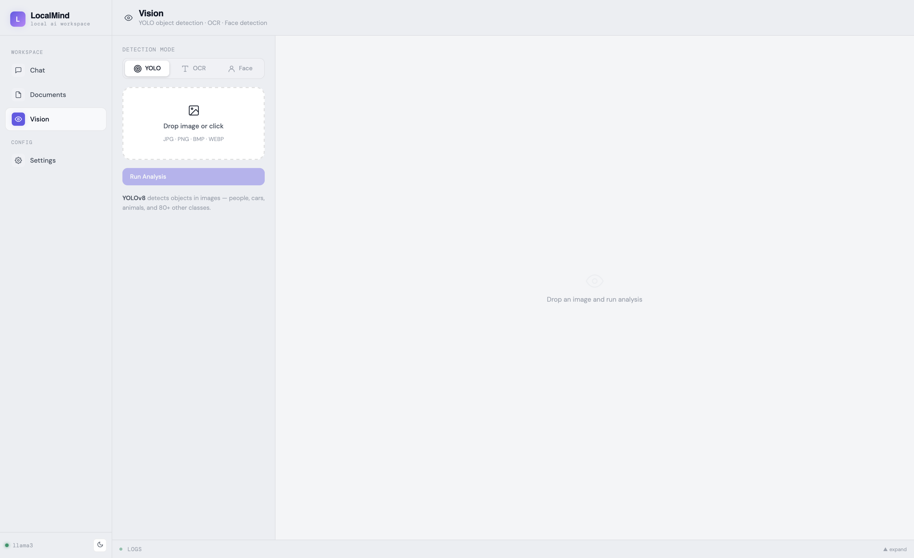
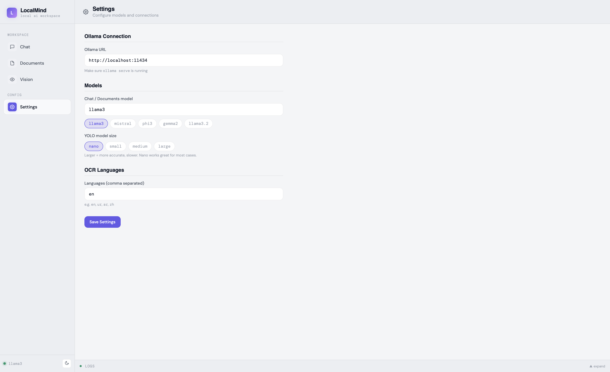

# LocalMind

> **Local AI workspace — chat, document Q&A, and computer vision. Everything runs on your machine. Nothing leaves it.**






---

## What is LocalMind?

LocalMind is a desktop app that puts AI tools on your computer without subscriptions, API keys, or cloud uploads. It combines three capabilities in one clean interface:

- **Chat** — Conversational AI powered by any Ollama model, with streaming responses and conversation history
- **Documents** — Upload PDFs, Word docs, text files, or paste text directly, then ask questions across all of them
- **Vision** — Drag and drop images for YOLO object detection, OCR text extraction, or face detection — all offline

Built with Python, FastAPI, and PyWebView.

---

## Requirements

- **Python 3.11 or 3.12** — Python 3.13+ is not supported (numpy/cv2 wheels unavailable)
- **[Ollama](https://ollama.com)** — local LLM runtime
- macOS, Windows, or Linux

---

## Installation

### 1. Install Ollama

Download from [ollama.com](https://ollama.com) and install it. Then pull a model:

```bash
ollama pull llama3
```

### 2. Clone the repo

```bash
git clone https://github.com/yourusername/localmind.git
cd localmind
```

### 3. Create a virtual environment with Python 3.12

```bash
# macOS / Linux
python3.12 -m venv venv
source venv/bin/activate

# Windows
python3.12 -m venv venv
venv\Scripts\activate
```

> If `python3.12` is not found on macOS, install it via Homebrew:
>
> ```bash
> brew install python@3.12
> /opt/homebrew/opt/python@3.12/bin/python3.12 -m venv venv
> ```

### 4. Install dependencies

```bash
pip install -r requirements.txt
```

> First install takes a few minutes — numpy, opencv, ultralytics, and easyocr are large packages. YOLO and OCR model weights download automatically on first use.

### 5. Run

```bash
# Terminal 1 — start Ollama
ollama serve

# Terminal 2 — start LocalMind (venv active)
python main.py
```

---

## Project Structure

```
localmind/
├── main.py              # App entry point — starts FastAPI + PyWebView window
├── api/
│   └── server.py        # FastAPI backend — all HTTP endpoints
├── core/
│   ├── chat.py          # Ollama streaming chat
│   ├── documents.py     # Document parsing, chunking, and Q&A
│   └── vision.py        # YOLO detection, OCR, face detection
├── ui/
│   └── index.html       # Complete frontend (single file)
├── data/
│   ├── uploads/         # Uploaded documents stored here (auto-created)
│   └── settings.json    # Your saved settings (auto-created)
├── assets/              # Screenshots for README
└── requirements.txt
```

---

## Chat

The Chat page gives you a direct conversation interface with your local model. Supports markdown, inline code, and code blocks in responses.

**Tips:**

- Press **Enter** to send, **Shift+Enter** for a new line
- Conversation history is kept for the session — the model remembers context within the same session
- Click **Clear** in the top bar to start a fresh conversation
- Long responses stream token by token so you see output immediately

---

## Documents

Upload documents or paste text, then ask questions about them.

**Supported formats:** PDF · DOCX · TXT · MD · CSV

**How it works:**

1. Upload files by dragging onto the drop zone, or click to browse
2. Or paste any text directly in the paste box at the bottom of the sidebar
3. Multiple documents can be loaded at once
4. Click a document to select/deselect it — selected docs are the ones searched
5. If nothing is selected, all loaded documents are searched
6. Type your question and press Enter

**Under the hood:** Documents are split into ~800-word segments. When you ask a question, keyword matching finds the most relevant chunks and passes them as context to the model — not the entire document. This keeps responses fast and accurate regardless of document size.

**Tips:**

- Specific questions get better answers than vague ones
- If the answer seems wrong, try rephrasing with keywords from the document
- Large PDFs (100+ pages) work fine — chunking handles them automatically

---

## Vision

Drop an image and run one of three analysis modes:

### YOLO Object Detection

Detects objects in images using YOLOv8. Returns bounding boxes, labels, and confidence scores with an annotated preview image.

- Detects 80+ object classes: people, cars, animals, furniture, electronics, and more
- Four model sizes available in Settings (nano → large)
- First run downloads model weights automatically (~6 MB for nano)

### OCR — Text Extraction

Extracts text from images using EasyOCR. Works on:

- Scanned documents and PDFs
- Screenshots with text
- Street signs and labels
- Handwritten text (lower accuracy)

Copy button exports the full extracted text to clipboard.

### Face Detection

Detects human faces using OpenCV Haar Cascades — extremely fast, fully offline, no model download needed. Returns face count and annotated image.

---

## Settings

### Ollama URL

Default: `http://localhost:11434`

Change this if Ollama is running on a different machine or port. LocalMind shows a red dot in the sidebar footer if Ollama is unreachable.

### Chat / Documents Model

The Ollama model used for chat and document Q&A. Quick-select chips are provided for common models, or type any model name manually.

| Model         | Size   | Best for                                   |
| ------------- | ------ | ------------------------------------------ |
| `llama3`      | 4.7 GB | General chat, good balance                 |
| `llama3.2`    | 2.0 GB | Faster responses, smaller                  |
| `mistral`     | 4.1 GB | Better reasoning and instruction following |
| `gemma2`      | 5.4 GB | Strong at Q&A and summarization            |
| `phi3`        | 2.3 GB | Excellent for its size, fast               |
| `deepseek-r1` | 4.7 GB | Strong reasoning, step-by-step thinking    |

Pull any model with:

```bash
ollama pull mistral
ollama pull gemma2
ollama pull phi3
ollama pull deepseek-r1
```

Then type the model name in Settings and save.

### YOLO Model Size

Controls the YOLOv8 model used for object detection. Larger = more accurate but slower.

| Size   | Model     | Speed    | Accuracy | Download |
| ------ | --------- | -------- | -------- | -------- |
| Nano   | `yolov8n` | Fastest  | Good     | ~6 MB    |
| Small  | `yolov8s` | Fast     | Better   | ~22 MB   |
| Medium | `yolov8m` | Moderate | Great    | ~50 MB   |
| Large  | `yolov8l` | Slow     | Best     | ~87 MB   |

Nano is recommended for everyday use. Weights download automatically on first use.

### OCR Languages

Comma-separated language codes for EasyOCR. Default is `en` (English).

| Code | Language             |
| ---- | -------------------- |
| `en` | English              |
| `ur` | Urdu                 |
| `ar` | Arabic               |
| `zh` | Chinese (Simplified) |
| `fr` | French               |
| `de` | German               |
| `hi` | Hindi                |
| `ja` | Japanese             |
| `ko` | Korean               |
| `es` | Spanish              |

Example for multilingual documents: `en, ur, ar`

Language models download automatically on first OCR run (~50–200 MB per language).

---

## Troubleshooting

**Ollama shows offline (red dot)**

Make sure Ollama is running in a separate terminal:

```bash
ollama serve
```

**"numpy is not installed" error**

You are likely on Python 3.13+. Create a new venv with 3.12:

```bash
python3.12 -m venv venv
source venv/bin/activate
pip install -r requirements.txt
```

**YOLO / OCR not working**

Reinstall the vision packages:

```bash
pip install ultralytics easyocr opencv-python --upgrade
```

**Document Q&A gives wrong answers**

- Check the chunk count in the sidebar — if it shows 0, the document didn't parse correctly
- Ask more specific questions using keywords from the document
- Switch to a larger model in Settings (`mistral` or `gemma2` tend to do better at Q&A than `llama3`)

**App window doesn't open**

Check the terminal output for errors. Most common cause is port `57892` already in use:

```bash
# macOS / Linux
lsof -i :57892
```

---

## Dependencies

| Package               | Purpose                           |
| --------------------- | --------------------------------- |
| `pywebview`           | Native desktop window             |
| `fastapi` + `uvicorn` | HTTP backend                      |
| `httpx`               | Streaming requests to Ollama      |
| `pymupdf`             | PDF text extraction               |
| `python-docx`         | Word document parsing             |
| `ultralytics`         | YOLOv8 object detection           |
| `easyocr`             | OCR text extraction               |
| `opencv-python`       | Image processing + face detection |
| `numpy`               | Required by cv2 and ultralytics   |

---

## License

MIT
